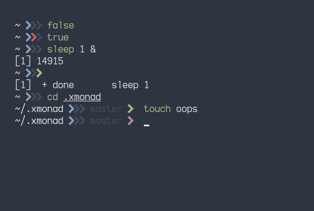

# Aloysius  ZSH

This is a fork of [@elenapan's](https://github.com/elenapan/dotfiles) lena ZSH
theme. Their prompt is static chevrons, I extended this to give me a little more
information in it.

The prompts operate as follows:

- **first**: generic 'this is a prompt' chevron
- **second**: previous return value
- **third**: background processes
- **fourth**: git prompt info, does not appear in unversioned directories

The default colour for the second and third is `black` and they change colour to
alert you to a non-standard behaviour of some kind. The git prompt is `green` if
you are up to date and `magenta` otherwise. Branch name is also shown in
`black`.

This is still a pretty minimal theme and suits my needs. For any functional
problems please raise an issue, otherwise this is personal preferences so
feature requests would have to be very strongly argued.
